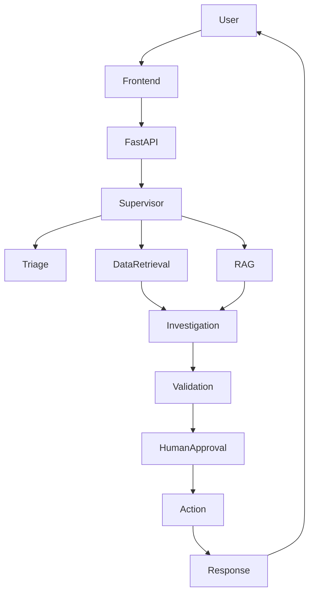
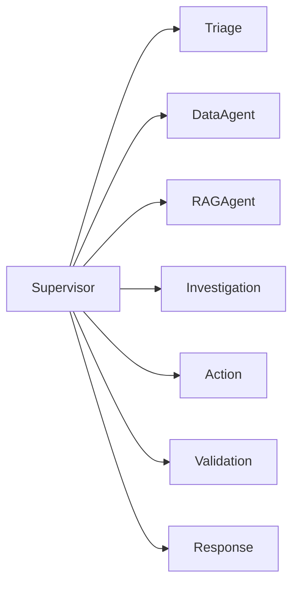
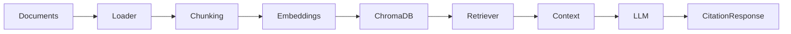

# Delivery Support Resolution Agent

## Project overview
This project implements a multi-agent AI application for delivery support resolution. It combines a supervisor-driven orchestration pattern, retrieval-augmented knowledge retrieval, operational tool execution, validation, and human-in-the-loop approval for consequential actions.

## Business problem
Customers regularly contact support with delivery delays, missing shipments, or refund requests. The support team needs a system that can quickly determine issue type, verify order data, fetch relevant policy guidance, identify the correct recommendation, and escalate high-risk cases for human approval.

## Primary users
- Customers
- Support agents
- Operations team

## Main goal
Create a grounded, auditable AI workflow that can investigate delivery issues, retrieve the correct policy, recommend the right action, and pause before any sensitive action is executed without approval.

## Features
- Multi-agent orchestration with a supervisor pattern
- Triage and intent classification
- Data retrieval from mock order APIs and policy knowledge
- Retrieval-augmented generation over a local knowledge base
- Structured workflow state and conditional routing
- Validation and guardrail checks
- Human approval for consequential actions
- FastAPI backend and Next.js frontend
- Dockerized local deployment
- Evaluation-ready architecture and test scaffolding

## Architecture



## Multi-agent architecture



## RAG architecture



## Agent responsibilities
- Supervisor: Coordinates the workflow and routes to the correct stage.
- Triage Agent: Identifies the issue, entities, urgency, and missing information.
- Retrieval Agent: Collects order, tracking, and customer context from tools.
- Knowledge / RAG Agent: Pulls support policy and operational guidance from a local knowledge base.
- Investigation Agent: Combines evidence and proposes the action.
- Action Agent: Executes permitted tool actions and surfaces approvals.
- Validation Agent: Checks compliance, evidence, and policy fit.
- Response Agent: Produces the final customer-facing summary with citations and evidence.

## Technology stack
- Frontend: Next.js + TypeScript + Tailwind CSS
- Backend: Python + FastAPI + Pydantic
- Agent framework: LangGraph
- LLM: OpenAI API
- RAG: Local document ingestion + chunking + embeddings + retrieval
- Vector database: ChromaDB
- Data store: PostgreSQL + SQLite fallback support
- Cache/session layer: Redis ready
- Testing: Pytest
- Deployment: Docker and Vercel-ready frontend

## Project structure

```text
GenAIProject/
├── README.md
├── docker-compose.yml
├── .env.example
├── .gitignore
├── backend/
│   ├── Dockerfile
│   ├── requirements.txt
│   ├── app/
│   │   ├── __init__.py
│   │   ├── config.py
│   │   ├── db.py
│   │   ├── main.py
│   │   ├── schemas.py
│   │   ├── agents/
│   │   ├── graph/
│   │   ├── prompts/
│   │   ├── rag/
│   │   ├── services/
│   │   └── tools/
│   └── tests/
├── frontend/
│   ├── app/
│   ├── package.json
│   ├── tsconfig.json
│   └── .env.example
├── data/
│   └── knowledge_base/
└── README.md
```

## Installation

### Python backend
```bash
cd backend
python -m venv .venv
source .venv/bin/activate
pip install -r requirements.txt
```

### Frontend
```bash
cd frontend
npm install
```

## Environment variables
Copy the sample environment file and update values as needed:

```bash
cp .env.example .env
cp frontend/.env.example frontend/.env.local
```

Required values include:
- OPENAI_API_KEY
- OPENAI_MODEL
- POSTGRES_URL
- REDIS_URL
- NEXT_PUBLIC_API_URL

## Running locally

### Start backend
```bash
cd backend
uvicorn app.main:app --host 0.0.0.0 --port 8000 --reload
```

### Start frontend
```bash
cd frontend
npm run dev
```

### Start with Docker
```bash
docker compose up --build
```

## API documentation
FastAPI auto-generates OpenAPI docs at:
- http://localhost:8000/docs
- http://localhost:8000/redoc

## Sample requests

### Chat request
```bash
curl -X POST http://localhost:8000/api/chat \
  -H "Content-Type: application/json" \
  -d '{
    "user_id": "user-001",
    "message": "My order ORD-1001 is delayed and I need an update."
  }'
```

### Workflow approval
```bash
curl -X POST http://localhost:8000/api/approval/<workflow_id> \
  -H "Content-Type: application/json" \
  -d '{
    "approved": true,
    "notes": "Customer has been informed and refund review is pending."
  }'
```

## Testing
```bash
cd backend
pytest
```

## Evaluation
The project includes a lightweight evaluation-ready structure. The recommended evaluation set includes:
- normal cases
- ambiguous cases
- missing-information cases
- tool-failure cases
- adversarial prompt-injection cases
- policy-conflict cases
- human-approval cases

Measures to track:
- intent classification accuracy
- retrieval relevance
- groundedness
- citation correctness
- tool selection
- policy compliance
- hallucination rate
- escalation correctness
- latency

## Docker
The repository includes a Docker Compose setup for:
- backend API
- PostgreSQL
- Redis
- ChromaDB

## Deployment
- Frontend: Vercel
- Backend: Dockerized and ready for Azure, AWS, Render, or Railway
- CORS and environment-configured API variables must be set in deployment

## Limitations
- The sample app uses mock order and policy data to keep the local demo realistic without proprietary data.
- LLM behavior depends on the OpenAI model and prompt guardrails configured in the environment.
- This implementation is a production-style skeleton and should be extended with secure auth, persistent DB models, and real integration services for full production use.

## Future enhancements
- Add PostgreSQL models and session persistence
- Add real ChromaDB collection management and metadata filtering
- Add LangSmith/OpenTelemetry integration
- Add stronger authentication and rate limiting
- Add admin evaluation dashboard with scorecards
- Add multi-user role-based approval workflows
